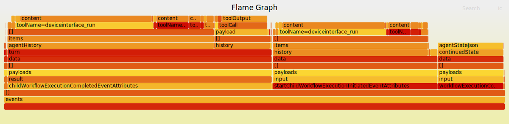

# engulf

`engulf` is a small command-line utility that analyses a JSON document and
converts it into an interactive SVG flame graph. This lets you see the shape
and size of your JSON at a glance – perfect for spotting the largest objects
or simply getting an overview of deeply nested data.

## CLI usage

```text
Usage: engulf [OPTIONS] <INPUT>

Arguments:
  <INPUT>  Input JSON file

Options:
  -o, --output <OUTPUT>    Output file (stdout if omitted)
      --group-by <KEY>...  Group array elements (objects) by one or more keys
  -h, --help               Print help
  -V, --version            Print version
```


### Quick example

```bash
# Analyse `data.json`, grouping array elements by their `type` field, and
# write the SVG flame graph to `data.svg`.

engulf data.json --group-by type -o data.svg

# Open `data.svg` in your browser to interact.
```

This is the svg produced from a temporal agent run. Open the svg in your browser to interact.


